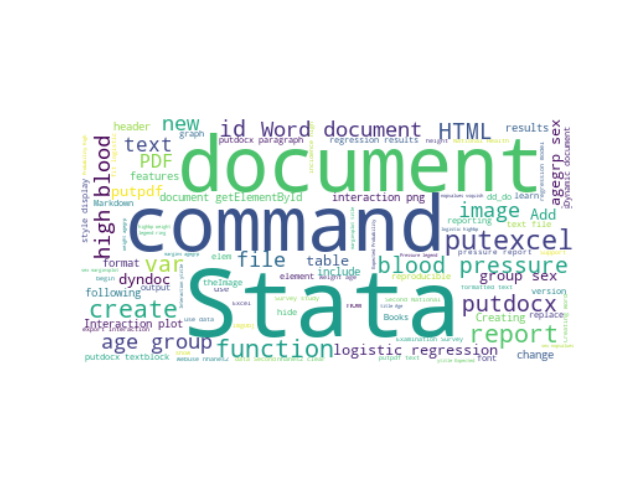

# Reproducible reporting—Creating HTML and Word documents from Markdown

##  [Hua Peng@StataCorp][hpeng]
### Stata Webinar
### [https://huapeng01016.github.io/dyndoc/](https://huapeng01016.github.io/dyndoc/)

# Reproducible research and reproducible documents

## Stata is good at reproducible research

- Manually performed data management and analysis can be easily turned into 
  scripts (do-files) 
- Scripts from 30 years ago still run and produce the same results today and 
  will do the same in future
- Datasets created 30 years ago can be read today and in future

## Stata 15 added commands for reproducible reporting in HTML   

- dyndoc 
- markdown
- dyntext

## Stata 16 added features for reproducible reporting in HTML

- dyndoc, docx 
- html2docx
- docx2pdf 

# Source files of this talk 

[dyndoc.zip](./dyndoc.zip) 

# Thanks!

[hpeng]: hpeng@stata.com
